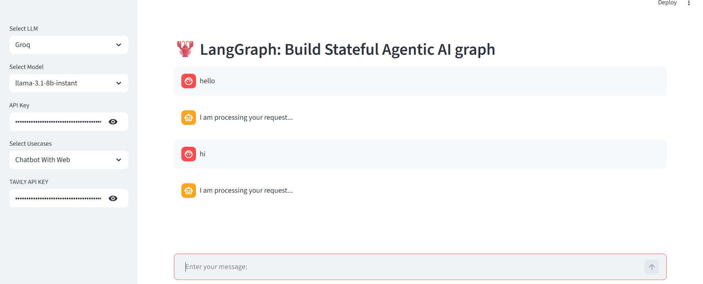
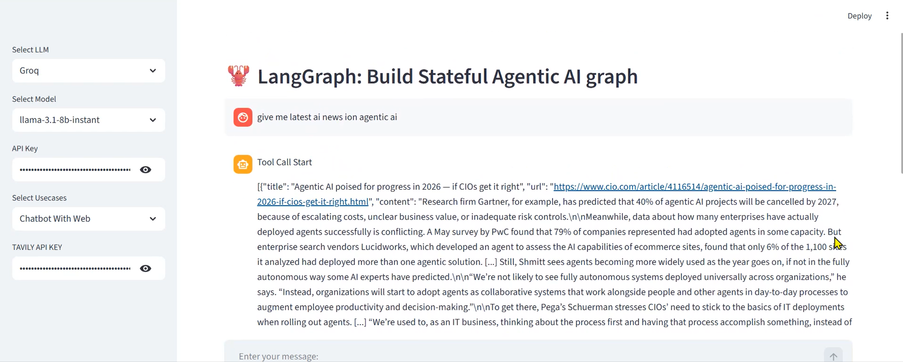
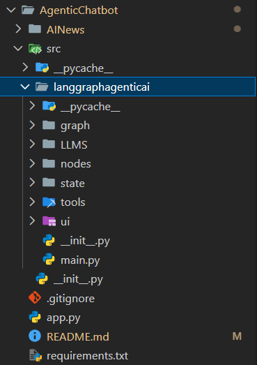
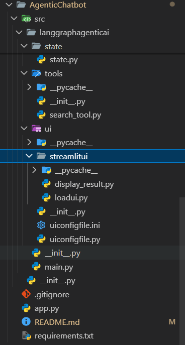
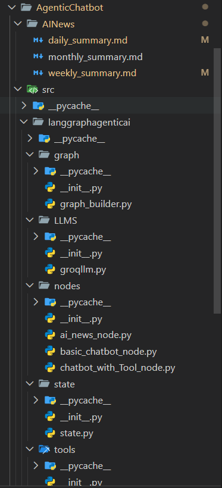
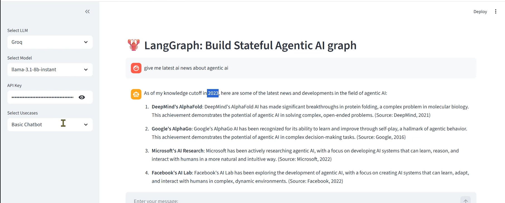
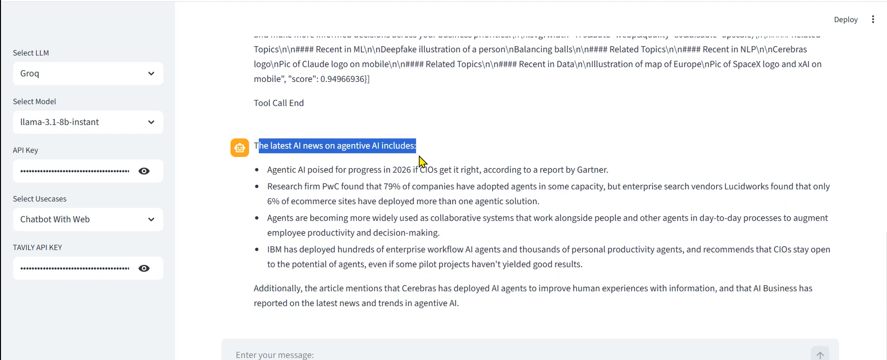
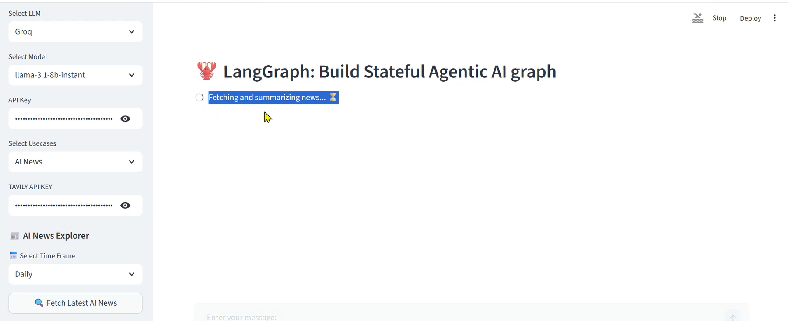
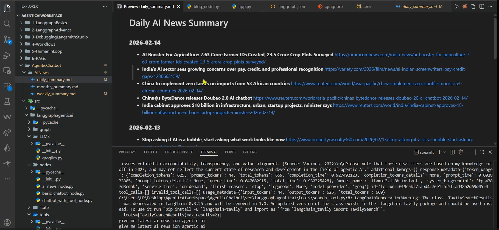
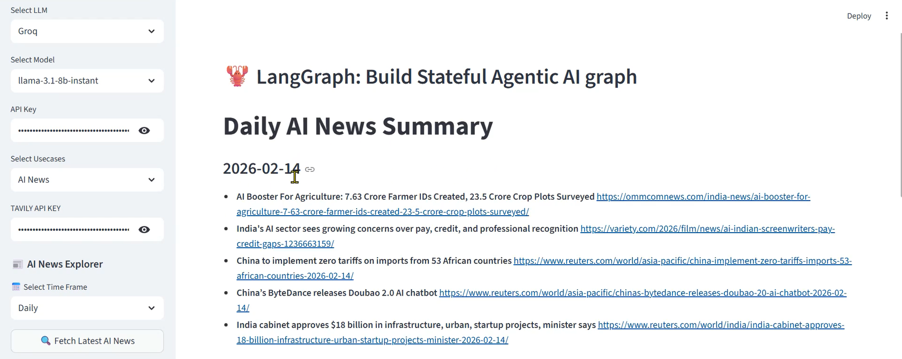

### End to End Agentic Chatbot
  #### An end-to-end AI Agentic system built with **LangGraph**, **LangChain**, and **Streamlit**. This chatbot goes beyond simple conversation by integrating real-time web search and automated news summarization.

## 🚀 Live Demo & walkthrough
- **Live Application:** [agenticchatbot-rathod0007.streamlit.app](https://agenticchatbot-rathod0007.streamlit.app/)
- **Video Walkthrough:** [Loom Demo](https://www.loom.com/share/37236413d1c34332b5211497a047ad9a)

## ✨ Features
- **Basic AI Chatbot:** Intelligent conversational interface.
- **Web Search Integration:** Powered by **Tavily API** for real-time external data retrieval.
- **AI News Summarizer:** Generates Daily, Weekly, and Monthly reports.
- **Automated Storage:** Summaries are automatically saved as Markdown files in a structured directory.
- **Modern UI:** Clean and responsive interface built with Streamlit.

## 📂 Project Structure
```text
AgenticChatbot/
├── AINews/                 # Generated AI News reports (.md)
│   ├── daily_summary.md
│   ├── monthly_summary.md
│   └── weekly_summary.md
├── src/
│   └── langgraphagenticai/
│       ├── graph/          # LangGraph workflow definitions
│       │   └── graph_builder.py
│       ├── LLMS/           # LLM configurations (Groq, etc.)
│       │   └── groqllm.py
│       ├── nodes/          # Individual agent nodes
│       │   ├── ai_news_node.py
│       │   ├── basic_chatbot_node.py
│       │   └── chatbot_with_tool_node.py
│       ├── state/          # State management for the graph
│       │   └── state.py
│       ├── tools/          # Custom tools (Tavily Search, etc.)
│       │   └── search_tool.py
│       ├── ui/             # Streamlit frontend components
│       │   └── streamlitui/
│       │       ├── display_result.py
│       │       ├── loadui.py
│       │       └── uiconfigfile.py
│       ├── main.py         # Logic entry point
│       └── __init__.py
├── app.py                  # Main Streamlit application entry
├── requirements.txt        # Project dependencies
└── README.md
```

## 🖼️ Visuals & Screenshots

### 🖥️ Application Interface
| Main UI | Web Search Feature |
| :---: | :---: |
|  |  |

### 📂 Project Structure Visuals
To understand the modular architecture of this agentic system:

| Core Structure | Source Internals | Sub-modules |
| :---: | :---: | :---: |
|  |  |  |

---

## 🤖 Feature Spotlights

### 1. Basic Chatbot
Simple and intuitive conversational agent powered by Groq/OpenAI.


### 2. Intelligent Web Search
The agent uses Tavily to browse the live web and provide cited answers.


### 3. AI News Summarizer
Automated workflows that generate and save markdown reports.
| Summarization Process | Generated Output |
| :---: | :---: |
|  |  |
|  | |


## 🛠️ Tech Stack

### 🧠 Orchestration & Frameworks


### 🤖 AI & LLM Inference


### 📊 Vector Store & Frontend


### 🚀 Domain Expertise


---

### 📦 Core Dependencies
The system leverages a modern AI stack for orchestration, inference, and real-time data:

* **Orchestration Framework:** `langgraph`, `langchain`, `langchain-core`, `langchain-community`, `langchainhub`
* **LLM Providers:** `langchain-groq` (Llama-3.1 8B instant), `langchain-openai`
* **Search Engine:** `tavily-python` (Optimized for AI Agents)
* **User Interface:** `streamlit`
* **Vector Database:** `faiss-cpu`
* **Environment & CLI:** `python-dotenv`, `langgraph-cli[inmem]`

---

## ⚙️ Installation & Setup

Follow these steps to get the Agentic Chatbot running locally:

### 1. Clone the Repository
```bash
git clone [https://github.com/rathod-0007/AgenticChatbot.git](https://github.com/rathod-0007/AgenticChatbot.git)
cd AgenticChatbot
```

### 2. Create a Virtual Environment (Recommended)
```bash
python -m venv venv
source venv/bin/activate  # On Windows: venv\Scripts\activate
```

### 3. Install Dependencies
```bash
pip install -r requirements.txt
```

### 4. Configure Environment Variables
Create a .env file in the root directory and add your API credentials:
```bash
GROQ_API_KEY=your_groq_api_key_here
TAVILY_API_KEY=your_tavily_api_key_here
OPENAI_API_KEY=your_openai_api_key_here
```

### 5. Launch the Application
```bash
streamlit run app.py
```
---